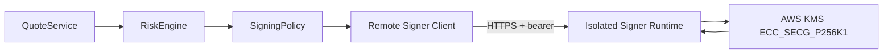

# Key Management

Signer key management is a critical security domain for RFQ systems. A trusted signer can authorize settlement, so signer capability must be isolated from normal business logic.

Institutional API keys are a separate credential class. They authorize HTTP operations but never grant EIP-712 signing capability, contract roles, venue access, or direct database access.

Key rotation must keep the institution's `principalId` stable while issuing a new `keyId` and secret digest. Quote ownership follows `principalId`; changing it creates a separate authorization boundary and intentionally loses API access to the prior principal's quote, settlement, hedge, and PnL records.

## Principles

- The signer must only sign typed RFQ quotes.
- The signer must only sign quotes approved by Risk Engine.
- Quote audit records must retain quoteId, snapshotId and riskPolicyVersion, while request logs retain traceId. AWS KMS receives only the EIP-712 Quote digest that the settlement contract can verify.
- Production API processes and Kubernetes Secrets must not contain the Ethereum private key.
- `.env.example` contains a public Anvil development key only; it must never be reused outside local development.
- Key rotation must be possible without redeploying all services.

## Recommended Production Model



## Controls

- API uses `RFQ_SIGNER_MODE=remote`; only the isolated signer process uses `RFQ_SIGNER_MODE=aws-kms`. Local private-key mode is rejected outside development and tests.
- Workload identity with `kms:Sign` restricted to one asymmetric key exists only on the signer ServiceAccount. The API ServiceAccount has no KMS role and no static AWS credentials.
- API-to-signer transport uses HTTPS with a private CA, a bounded bearer token and default-deny NetworkPolicy. Plain HTTP requires an explicit local-only switch and is rejected in production.
- The signer authenticates before parsing a request, independently enforces enabled chains, whitelisted tokens, TTL and raw amount bounds, then locally verifies every KMS signature. The API client verifies the trusted signer again before returning a quote.
- Explicit `RFQ_TRUSTED_SIGNER_ADDRESS` independent from KMS output.
- Optional `RFQ_TRUSTED_SIGNER_OVERLAP_ADDRESSES` contains at most four explicit prior or next signer addresses and is used only for settlement verification during a bounded rotation window.
- Strict DER parsing, low-s normalization and address recovery before returning a signature.
- Per-token and per-chain notional limits.
- Audit logs for every signing request and response.
- Emergency signer removal from `RFQSettlement`.

## API Key Controls

- Issue `keyId.secret` credentials through an out-of-band secret channel and place only `SHA-256(secret)` in `RFQ_API_KEY_CONFIG_JSON`.
- Assign the minimum fixed scopes from `quote:write`, `submit:write`, `status:read`, `pnl:read`, `admin:read`, and `admin:write`; do not give browser bundles or ordinary quote clients PnL or admin scopes. Use a dedicated operations principal/key for `admin:write`, and separate read-only automation onto `admin:read`.
- Every global or pair quote pause/resume requires a non-empty incident/change reason and compare-and-swap `expectedVersion`; retain the resulting authenticated actor and version in `quote_control_audit` or `quote_pair_control_audit`.
- Give the automatic toxic-flow analyzer a dedicated non-interactive PostgreSQL role limited to reading canonical settlement/snapshot evidence, leasing markout jobs, writing markouts, and CAS-updating score/audit rows. It does not receive an HTTP admin key, signer, RPC, venue, Kafka or ClickHouse credential. Use separate `admin:read` and `admin:write` API credentials for human diagnostics and reviewed correction versions. Every publication records the worker actor, analyzer policy version, sample window and observation time in `toxic_flow_score_audit`; never place administrative credentials in browsers or ordinary trading clients.
- Keep API key configuration in `rfq-backend-secrets` / Helm `apiKeySecret`, never in the ConfigMap, image, repository, log, trace, metric label, or worker Secret.
- Give each internal trading console a dedicated minimum-scope key. Store its plaintext only in the external `rfq-frontend-api-key` Secret as an Nginx `proxy_set_header` include; never place it in `VITE_*`, `runtime-config.js`, browser storage, the image, or Helm values.
- Rotate a frontend key by updating the backend digest configuration and frontend plaintext Secret as one reviewed change, rolling all frontend Pods, confirming one canary quote, then revoking the old digest. Secret volume refresh alone is insufficient because active Nginx workers read configuration at startup.
- Rotate by adding a new key id, updating clients, observing old-key traffic at the edge, then removing the old digest. Use `expiresAt` as a hard upper bound, not as the only revocation mechanism.
- Authentication failures return one generic response. Operators diagnose bounded `missing|malformed|invalid|expired|scope_denied` metrics without exposing a key id or principal label.

## Rotation Procedure

1. Open a change record with both signer addresses, affected chains, the maximum quote TTL, receipt-confirmation allowance, indexer catch-up buffer and rollback owner.
2. Create the new KMS key, run `RFQ_AWS_KMS_INTEGRATION_CONFIRM=sign-eip712-digest make aws-kms-integration-check` from the target workload identity, verify its recovered address out of band, and then run the normal quote-path canary in staging. Archive digest/hash evidence, never the raw signature or credential-bearing errors.
3. Call `RFQSettlement.setTrustedSigner(newSigner)` through `SIGNER_ADMIN_ROLE`. Confirm that both addresses return true from `trustedSigners`, `trustedSignerCount` is within `MAX_TRUSTED_SIGNERS = 5`, and record the transaction hash. This does not revoke the old signer.
4. Roll out a verifier-only transition to every API replica while the old signer workload still signs: keep `RFQ_TRUSTED_SIGNER_ADDRESS=oldSigner` and set `RFQ_TRUSTED_SIGNER_OVERLAP_ADDRESSES=newSigner`. Confirm mixed old/new signatures are accepted before proceeding.
5. Roll the signer workload to the new KMS key and `RFQ_TRUSTED_SIGNER_ADDRESS=newSigner`, then roll API trust while retaining `oldSigner` in `RFQ_TRUSTED_SIGNER_OVERLAP_ADDRESSES`. Record the final old-key signing time and run a new-key quote and settlement canary.
6. Wait for old quotes to expire. The retirement time must be later than the final old-key signature by `RFQ_QUOTE_TTL_SECONDS` plus clock-skew, receipt-confirmation and indexer catch-up buffers.
7. Reconcile old-key quotes, then call `RFQSettlement.setTrustedSignerAuthorization(oldSigner, false)`. Confirm old signatures are rejected on chain while new signatures still settle.
8. Remove `oldSigner` from `RFQ_TRUSTED_SIGNER_OVERLAP_ADDRESSES` in a final rollout and confirm all replicas expose healthy signer and settlement readiness.
9. Archive both rollout revisions, signer-set events, KMS key ids, canary evidence and reconciliation results. Disable the old key immediately after retirement and destroy it only after audit sign-off.

The runtime uses AWS KMS `MessageType=DIGEST` with `ECDSA_SHA_256`; the key spec must be `ECC_SECG_P256K1` and key usage must be `SIGN_VERIFY`. Never remove the old signer before the overlap rollouts and expiry buffers complete. Never leave an overlap address configured after its on-chain authorization has been retired.

## Signing Audit Credential

Signer 使用独立 PostgreSQL 登录，不得复用 API 的 `DATABASE_URL` 或 DDL migrator。迁移账号依次应用 migration `027-signer-audit.sql` 与 `028-signer-risk-context.sql` 后，由数据库管理员授予最小权限：

```sql
GRANT USAGE ON SCHEMA public TO rfq_signer_audit;
GRANT INSERT ON TABLE public.signer_audit_events TO rfq_signer_audit;
GRANT USAGE ON SEQUENCE public.signer_audit_events_id_seq TO rfq_signer_audit;
```

不要授予 `UPDATE`、`DELETE`、业务表读取或 schema DDL 权限。`/ready` 通过 `pg_attribute` 系统目录检查 migration 028 必需列，因此运行账号不需要 `SELECT` 审计表。`RFQ_SIGNER_AUDIT_DATABASE_URL` 必须使用独立 secret、`sslmode=verify-full`、受信 CA 和小连接池；Signer 的 Cilium egress 只放行配置的 PostgreSQL FQDN/5432。审计表只保存关联标识、EIP-712 digest、signature hash 和有界结果，不保存原始 signature、用户数量、token、bearer token、KMS 原始错误或数据库凭据。

## Incident Response

If signer compromise is suspected:

1. Pause settlement if blast radius is unclear.
2. Stop Signer Service and preserve signing audit evidence.
3. Authorize a clean key with `RFQSettlement.setTrustedSigner(cleanSigner)`, then immediately revoke the now non-primary compromised address with `setTrustedSignerAuthorization(compromisedSigner, false)`.
4. Reconfigure backend trust without the compromised overlap and keep settlement paused until the mixed-fleet rollout is complete.
5. Reconcile settlement events, signed quotes, inventory and hedge activity across the compromise window.
6. Resume only after a clean-key canary and publish the incident report and mitigation.
