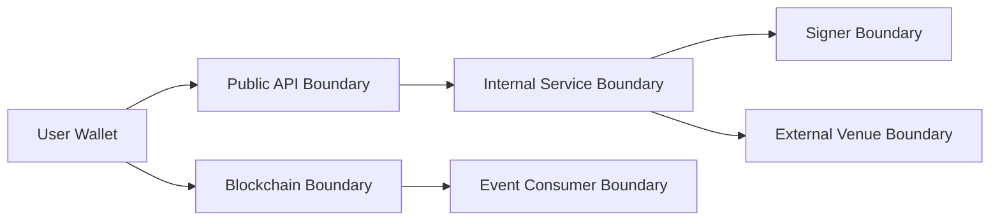

# Threat Model

本威胁模型覆盖 RFQ / Prop AMM 做市系统的第一版边界：API、Pricing、Risk、Signer、Settlement Contract、Inventory、Hedge 和 Observability。

## Assets

- Signer private key 或 KMS signing capability
- Trusted signer allowlist
- User funds and treasury funds
- Quote database and risk decisions
- Market data snapshots
- Inventory positions
- Settlement events
- Hedge venue credentials
- Institutional RFQ API secrets and scope assignments
- Kafka/ClickHouse analytics credentials and high-dimensional event data

## Trust Boundaries

## Threats

| Threat | Impact | Mitigation |
| --- | --- | --- |
| Signer key compromise | Attacker can authorize malicious quotes | AWS KMS workload identity, key-scoped `kms:Sign`, explicit signer address, notional limits, pause, key rotation |
| Wrong KMS key or malformed DER | Quotes are signed by an unintended key or parser ambiguity changes signature meaning | explicit trusted signer, strict DER integer/length validation, low-s normalization, address recovery |
| Quote replay | Same quote executed multiple times | Nonce replay protection in contract |
| Cross-replica submit race | Multiple API replicas verify or relay the same signed quote concurrently | PostgreSQL quote-scoped lease with server-time expiry and owner-token release; fail closed when unavailable; contract nonce remains authoritative |
| Cross-chain replay | Quote valid on unintended chain | EIP-712 domain and Quote `chainId` |
| Quote field tampering | User changes amount or token | EIP-712 typed data verification |
| Stale market data | Mispriced quote | snapshot TTL, market data health check, conservative fallback |
| Risk bypass | Unsafe quote gets signed | signer only accepts approved risk decision |
| Mempool MEV | User or hedge transaction exploited | short TTL, minAmountOut, private submission where possible |
| Event duplication | Inventory updated twice | idempotency key `(chainId, txHash, logIndex)` |
| Chain reorg | Inventory reflects reverted event | confirmation depth and replayable indexer |
| Lost wallet callback | Contract settles but inventory, hedge and PnL never observe the trade | independent confirmed-log indexer, durable cursor, idempotent event application |
| Malicious or inconsistent RPC history | Indexer skips events or removes valid inventory | bounded block-hash checkpoints, log-to-quote verification, deep-reorg fail-closed, independent-provider incident verification |
| Hedge credential leak | External venue account loss | secret isolation, least privilege, withdrawal disabled |
| Analytics credential leak | Event exfiltration, forged analytics or broker disruption | separate worker Secret, SASL/TLS, topic/table ACLs, no signer or venue credentials |
| Event poisoning or offset skip | Analytics evidence becomes incomplete or misleading | closed envelope validation, 1 MiB bound, insert-before-offset commit, replay and event-id deduplication |
| API credential disclosure or scope escalation | Unauthorized quote, submit, status, or PnL access | SHA-256 secret digests only, constant-time comparison, fixed scopes, expiry, Secret isolation, generic rejection responses and rotation |
| Cross-tenant IDOR or signed-quote submission | One institution reads or settles another institution's quote and derived records | Persist immutable quote `principal_id`; scope quote, submit and PnL access by principal; derive settlement and hedge ownership from quote; return not-found on mismatch |
| Unauthorized or conflicting quote-control change | Attacker or stale operator action disables quoting or resumes unsafe signing | Separate `admin:read`/`admin:write` scopes, dedicated operations keys, CAS version, mandatory reason, authenticated audit row and bounded metrics |
| Quote-control database outage | Replicas disagree about whether new quotes may be signed | Shared PostgreSQL singleton, readiness degradation and fail-closed `POST /quote`; never fall back to pod-local enabled state in production |

## Security Requirements

- Signer Service must not expose arbitrary signing.
- Contract must reject untrusted signer, used nonce, expired quote, unsupported token and wrong chain.
- Non-local API replicas must acquire the shared submit reservation before settlement verification; they must not fall back to process-local state or bypass it during a database incident.
- API must validate all addresses and integer strings.
- Every non-local business API request must authenticate with a scoped key; probes remain separately network-restricted.
- Administrative quote-control routes require dedicated admin scopes; ordinary quote, submit, status, PnL and browser credentials must not inherit them.
- Authorization must use the stable institution principal. Key rotation preserves that principal, wallet addresses do not establish tenant ownership, and `principalId` must not enter EIP-712 or public response schemas.
- Risk rejection must be logged but not leak sensitive thresholds.
- Admin functions must be protected and auditable.

## Open Questions

- Which private transaction path is supported per chain for the wallet-driven settlement transaction.
- Whether a future multi-cloud deployment should replace AWS KMS through `external` signer mode.
