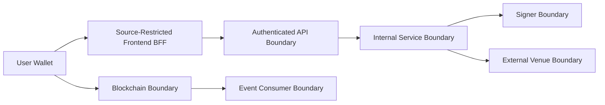

# Threat Model

本威胁模型覆盖 RFQ / Prop AMM 做市系统的第一版边界：API、Pricing、Risk、Signer、Settlement Contract、Inventory、Hedge 和 Observability。

## Assets

- Signer private key 或 KMS signing capability
- Trusted signer allowlist
- User funds and treasury funds
- Quote database and risk decisions
- Market data snapshots
- Inventory positions
- Settlement events
- Hedge venue credentials
- Institutional RFQ API secrets and scope assignments
- Internal frontend BFF credential, runtime configuration, and source allowlist
- Kafka/ClickHouse analytics credentials and high-dimensional event data

## Trust Boundaries

## Threats

| Threat | Impact | Mitigation |
| --- | --- | --- |
| Signer key compromise | Attacker can authorize malicious quotes | AWS KMS workload identity, key-scoped `kms:Sign`, explicit signer address, notional limits, pause, key rotation |
| Wrong KMS key or malformed DER | Quotes are signed by an unintended key or parser ambiguity changes signature meaning | explicit trusted signer, strict DER integer/length validation, low-s normalization, address recovery |
| Unverified KMS rollout identity or diagnostic leakage | A release can access the wrong key/domain, or a failed production probe exposes key ids, provider details or a reusable signature | Opt-in target-workload canary forces production KMS config, signs only a short-lived synthetic digest, independently recovers the reviewed signer, always closes the SDK client, emits only digest/signature hash and replaces provider/close failures with a fixed error |
| Signer rotation ordering gap | A rolling fleet rejects valid old/new quotes, or a stale authorized key remains usable indefinitely | bounded five-signer contract set, primary plus at most four backend overlap signers, two-phase rollout, TTL/finality buffer, explicit retirement event |
| Quote replay | Same quote executed multiple times | Nonce replay protection in contract |
| Quote retry amplification | Client or proxy retries create multiple signed nonces and duplicate open-exposure reservations | principal-scoped `Idempotency-Key`, request fingerprint, PostgreSQL owner lease, quote binding before persistence, exact response replay |
| Unverified target quote path or canary credential leakage | A rollout appears healthy while market, pricing, risk, persistence, remote signer or ownership paths are broken; diagnostics expose the operator API key or reusable signature | Explicitly acknowledged HTTPS target canary uses a least-privilege key, requires healthy readiness, exact idempotency replay and persisted signed status, independently recovers the reviewed signer, never submits, prints only hashes and replaces runtime failures with a fixed error |
| Unsafe or ambiguous target settlement canary | A rollout test spends production funds, grants excessive allowance, broadcasts twice after a lost response, or leaks wallet/API/RPC credentials while chain and backend projections diverge | Staging/testnet-only chain guard, dedicated minimally funded wallet, owner-only `0600` key file, explicit input/output and allowance caps, HTTPS/no-redirect API, exact simulation and single broadcast attempt, no automatic retry, public tx-hash-only recovery, receipt/calldata/event/nonce/balance verification and backend settlement/hedge/PnL checks |
| Cross-replica submit race | Multiple API replicas verify or relay the same signed quote concurrently | PostgreSQL quote-scoped lease with server-time expiry and owner-token release; fail closed when unavailable; contract nonce remains authoritative |
| Cross-chain replay | Quote valid on unintended chain | EIP-712 domain and Quote `chainId` |
| Quote field tampering | User changes amount or token | EIP-712 typed data verification |
| Non-standard ERC20 settlement drift | Fee-on-transfer, sender-fee or rebasing behavior makes recorded amounts differ from actual debits and credits | Exact pre/post user and Treasury balance-delta checks on both token legs; any mismatch atomically reverts the nonce and transfers |
| Partial, orphaned, or substituted contract deployment | Deployment is interrupted or the configured target points to wrong bytecode, split Treasury wiring, hidden signer/token/admin membership, retained factory authority, or a wrong chain/domain | A dedicated factory deploys and hands off atomically; an opt-in same-block target-chain canary compares immutable-aware runtime artifacts and proves exact wiring, EIP-712 domain, signer, whitelist and role-member state before quote admission |
| Owner and role authority divergence | A Settlement owner whose default admin role was revoked uses ownership transfer to grant a fresh address every administrative role | `transferOwnership` requires both current owner identity and `DEFAULT_ADMIN_ROLE`; role revocation therefore remains an effective emergency containment boundary |
| Stale market data or demonstration prices | Mispriced production quote | snapshot TTL, market data health check, non-local static-provider startup requires a non-empty mandatory live CEX source set, conservative Chainlink fallback only |
| Wrong or unbounded Chainlink feed | A valid proxy for another pair, plaintext RPC interception, stale L2 state, or extreme oracle answer produces a signed misprice | HTTPS-only remote RPC, non-zero reviewed proxy, exact onchain description/decimals, raw min/max answer circuit breaker, timestamp checks, L2 sequencer grace policy and direct target-feed canary |
| Unroutable aggregated CEX depth | Reference venues or an unconfigured Binance symbol inflate `liquidityUsd`, understate size impact, and authorize a quote the deployed hedge worker cannot cover | Explicit `hedge`/`reference` roles; only accepted hedge sources contribute depth; API and worker share one route table; startup binds every hedge source to the exact chain, token pair, venue and symbol; a reference-only quorum fails closed |
| Oversized or regressed CEX market data | An exchange, intermediary or compromised connection sends an oversized frame/snapshot or older event time to exhaust memory or roll a synchronized local book backward | Bound WebSocket text frames to 1 MiB and streamed REST snapshots to 2 MiB before JSON decoding; reject binary frames and event-time regression; clear the book, require a new full snapshot and reconnect with capped equal jitter |
| Unbounded CEX hedge execution | A thin or manipulated book causes a market hedge to execute far outside the signed quote economics | Derive buy ceiling or sell floor from immutable settlement amounts; apply reviewed route slippage; round conservatively to the exchange price tick; persist immutable `bounded-limit-v1`; submit only `LIMIT GTC` with query-first idempotency |
| Stale resting CEX hedge order | A bounded limit remains live after its market context expires, later fills into an unintended inventory position, or is duplicated after an ambiguous cancel | Persist an immutable maximum order age; authorize cancellation from PostgreSQL time; durably record cancel intent before signed `DELETE`; query and retry by the same client id; treat missing or ambiguous responses as unknown and preserve cumulative fills |
| Production venue contact or unexpected testnet canary fill | A deployment check reaches real funds, or a supposedly harmless test order executes and leaves exposure | Hard-code the Spot Testnet origin; require explicit place-and-cancel acknowledgement and a dedicated no-withdrawal test key; validate live filters; enforce a configurable minimum distance from the book; require confirmed cancellation, terminal query and zero base/quote/trade evidence; retain the client id for cleanup and incident reconciliation |
| Risk bypass | Unsafe quote gets signed | signer only accepts approved risk decision |
| Mempool MEV | User or hedge transaction exploited | short TTL, minAmountOut, private submission where possible |
| Event duplication | Inventory updated twice | idempotency key `(chainId, txHash, logIndex)` |
| Chain reorg | Inventory reflects reverted event | confirmation depth and replayable indexer |
| Lost wallet callback | Contract settles but inventory, hedge and PnL never observe the trade | independent confirmed-log indexer, durable cursor, idempotent event application |
| Wrong-chain or plaintext settlement RPC | Receipt verification, Treasury risk, or indexer state is derived from another chain or modified in transit | HTTPS-only non-local receipt/indexer URLs, exact active `eth_chainId` check before evidence or cursor access, fail-closed readiness and no cursor advance |
| Malicious or inconsistent RPC history | Indexer skips events or removes valid inventory | bounded block-hash checkpoints, log-to-quote verification, deep-reorg fail-closed, independent-provider incident verification |
| Hedge credential leak | External venue account loss | secret isolation, least privilege, withdrawal disabled |
| Stale or tampered CEX symbol rules | Quotes advertise executable depth while hedge orders violate venue quantity, price or notional filters | HTTPS-only `exchangeInfo`, bounded cache, exact decimal validation, shared API/worker readiness, pre-authorization order validation and route-drift alerting |
| Analytics credential leak | Event exfiltration, forged analytics or broker disruption | separate worker Secret, SASL/TLS, topic/table ACLs, no signer or venue credentials |
| Pod lateral movement or unrestricted exfiltration | A compromised workload reaches API internals, worker metrics, databases, Redis or arbitrary external services | ingress-selecting Kubernetes NetworkPolicies with default-deny egress, per-workload Cilium exact-FQDN-and-port policies, DNS proxy enforcement, explicit ingress-controller and monitoring namespace labels, and provider firewall defense in depth |
| Privileged container persistence or token theft | A process exploit modifies application files, uses ambient capabilities, or steals an unnecessary Kubernetes credential | fixed non-root UID/GID, RuntimeDefault seccomp, no privilege escalation, all capabilities dropped, read-only root filesystems, bounded `/tmp`, and ServiceAccount token automount disabled for every worker |
| Plaintext or downgrade-prone dependency transport | Database rows, Redis identities, settlement evidence, analytics events or credentials can be observed or modified in transit | non-local PostgreSQL `sslmode=verify-full`, optional absolute CA path, Redis `rediss://`, settlement RPC HTTPS, Kafka TLS plus SASL, ClickHouse HTTPS, shared runtime validation in API, workers and migration |
| Event poisoning or offset skip | Analytics evidence becomes incomplete or misleading | closed envelope validation, 1 MiB bound, insert-before-offset commit, replay and event-id deduplication |
| API credential disclosure or scope escalation | Unauthorized quote, submit, status, or PnL access | SHA-256 secret digests only, constant-time comparison, fixed scopes, expiry, Secret isolation, generic rejection responses and rotation |
| Frontend credential disclosure or proxy route expansion | Browser users recover an institutional secret or reach health, metrics, admin, or future API routes | per-institution TLS/source-restricted deployment, plaintext key only in a read-only Secret include, same-origin runtime config without secrets, exact route/method allowlist, unknown `/api/` fail-closed, dedicated NetworkPolicies, restart-on-rotation |
| Cross-tenant IDOR or signed-quote submission | One institution reads or settles another institution's quote and derived records | Persist immutable quote `principal_id`; scope quote, submit and PnL access by principal; derive settlement and hedge ownership from quote; return not-found on mismatch |
| Unauthorized or conflicting quote-control change | Attacker or stale operator action disables global/pair quoting or resumes unsafe signing | Separate `admin:read`/`admin:write` scopes, dedicated operations keys, normalized direction-independent pair keys, CAS version, mandatory reason, authenticated audit row and bounded metrics |
| Quote-control database outage | Replicas disagree about whether new quotes may be signed | Shared PostgreSQL singleton, readiness degradation and fail-closed `POST /quote`; never fall back to pod-local enabled state in production |
| Forged, stale, or conflicting toxic-flow score | Attacker suppresses a risky user or denies service to a safe user through manipulated analyzer evidence | Dedicated least-privilege analyzer database role, canonical settlement and bounded snapshot evidence, lease/revision processing, freshness checks, CAS version, immutable audit, fixed threshold policy and fail-closed shared-store reads |

## Security Requirements

- Signer Service must not expose arbitrary signing.
- Signer rotation must establish old/new verification overlap before changing the signing key, then retire the old signer after the last old quote and settlement-observation buffers expire.
- Contract must reject untrusted signer, used nonce, expired quote, unsupported token and wrong chain.
- Settlement ownership transfer must require the current owner to retain `DEFAULT_ADMIN_ROLE`; revoking that role must prevent ownership from being used to restore administrative authority.
- Non-local API replicas must acquire the shared submit reservation before settlement verification; they must not fall back to process-local state or bypass it during a database incident.
- Non-local quote requests must claim a shared principal-scoped idempotency record before nonce generation; key reuse with a different payload, active ownership, or unavailable storage must fail closed.
- API must validate all addresses and integer strings.
- Every non-local business API request must authenticate with a scoped key; probes remain separately network-restricted.
- Production browsers must use the per-institution BFF. Institutional plaintext keys must never enter Vite variables, runtime JavaScript, browser storage, images, logs, or metrics; the BFF may proxy only the six reviewed trading route/method pairs and must reject all other API paths.
- Global and pair administrative quote-control routes require dedicated admin scopes; ordinary quote, submit, status, PnL and browser credentials must not inherit them.
- Human toxic-flow score reads and corrections require separate least-privilege admin credentials. The automatic analyzer uses only its restricted PostgreSQL role; analyzer database credentials must not reach browser, quote, submit, signer, hedge or analytics runtimes, and admin API credentials must not reach analyzer pods.
- API and worker pods must be selected by ingress-and-egress policies. API ingress is limited to explicitly labeled ingress-controller and monitoring namespaces; worker metrics ingress is limited to same-namespace callers and the explicit monitoring namespace. Standard Kubernetes policies declare `egress: []`; per-workload Cilium policies permit cluster DNS and exact approved KMS、CEX、Chainlink/RPC、database、cache and analytics FQDN/port pairs. Runtime URL and FQDN policy changes must deploy together, and no generic 443 or wildcard destination rule may bypass the allowlist.
- API, migrator and worker containers must run as fixed non-root UID/GID, disable privilege escalation, drop all Linux capabilities, use RuntimeDefault seccomp and keep the image filesystem read-only. Only a bounded `/tmp` volume may be writable. Every workload must set `automountServiceAccountToken=false`; the API uses the separate audience-scoped token projected by EKS IRSA for KMS access.
- Every non-local API, worker and migration process must reject PostgreSQL transport below `sslmode=verify-full`; the API must reject non-TLS Redis, receipt and settlement-indexer RPCs must use HTTPS, and analytics must reject Kafka without TLS/SASL or ClickHouse without HTTPS. Receipt verification, Treasury reads and every indexer poll must prove the active RPC chain ID before consuming chain data. Deployment manifests must pass `NODE_ENV=production` to every process so these checks cannot be bypassed by an omitted environment field.
- Authorization must use the stable institution principal. Key rotation preserves that principal, wallet addresses do not establish tenant ownership, and `principalId` must not enter EIP-712 or public response schemas.
- Risk rejection must be logged but not leak sensitive thresholds.
- Admin functions must be protected and auditable.

## Open Questions

- Which private transaction path is supported per chain for the wallet-driven settlement transaction.
- Whether a future multi-cloud deployment should replace AWS KMS through `external` signer mode.
